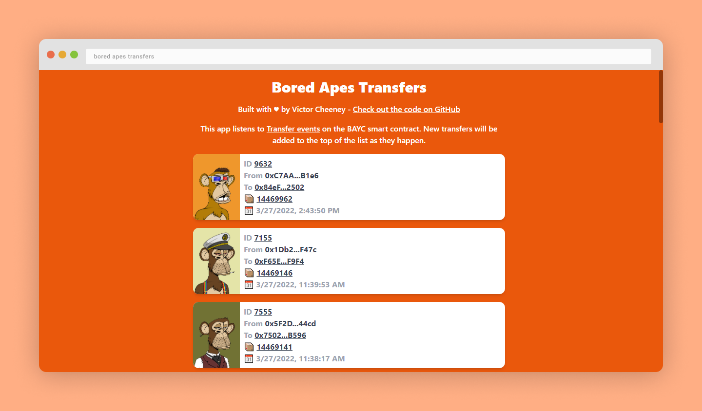

# Bored Apes Transfers

A simple web3 app that listens to Transfer events on the BYAC smart contract.

## Table of contents <!-- omit in toc -->

- [☀ Introduction](#-introduction)
- [💭 What I learned](#-what-i-learned)
- [💻 Live Demo](#-live-demo)
- [💿 Setup](#-setup)
  - [Prerequisites](#prerequisites)
  - [Installation steps](#installation-steps)
  - [Usage](#usage)
- [🛠 Technologies Used](#-technologies-used)

## ☀ Introduction

Always on a quest to learn new things, I wanted to create a simple project that would allow me to:

1. Try out the Svelte compiler / SvelteKit web app framework
2. Try the [web3.js](https://web3js.readthedocs.io/en/v1.7.1/) library (had previously only worked with [ethers.js](https://docs.ethers.io/v5/))
3. Build something related to NFTs ([ERC-721](https://ethereum.org/en/developers/docs/standards/tokens/erc-721/) tokens)

## 💭 What I learned

I only spent a few hours on this project, focusing on getting the main functionality working. Therefore, I still have to dive deeper into the fundamentals of the previously mentioned technologies to master them properly. Still, I had fun experimenting and those are the main key takeaways I'll remember from this experiment:

- Enjoyed the reactive declaration system. It made me think of the `useEffect` hook in React but in a much cleaner fashion.

```ts
$: console.log(dependency); // This line runs every time the dependency's value changes
```

- Had a look at writable data stores through the [svelte-web3](https://github.com/clbrge/svelte-web3) library I used in the project
- I learned about IPFS and how to retrieve the data through gateways
- Built an API route which very similar to how I would do in NextJS
- Learned that SvelteKit is to Svelte what NextJS is to React

## 💻 Live Demo

https://boredapestransfers.victorc.dev/

Note: You'll see that MetaMask requests you to connect, feel free to just close the popup. The app will work the same.

## 💿 Setup

### Prerequisites

- Node v16 or above
- NPM
- A web browser (Chrome for example) with [MetaMask](https://metamask.io/) installed

### Installation steps

First, clone the repository with the following command:

```sh
git clone git@github.com:vcheeney/BoredApesTransfers.git
```

### Usage

Run the development app with the following command:

```sh
npm run dev
```

## 🛠 Technologies Used

- [TypeScript 4.6.2](https://www.typescriptlang.org/docs/) - JavaScript superset
- [Svelte](https://kit.svelte.dev/) - Frontend compiler
- [SvelteKit](https://kit.svelte.dev/) - Web app framework
- [TailwindCSS 3.0.23](https://tailwindcss.com/docs/installation) - Utility-based CSS framework
- [svelte-Web3 3.3.8](https://github.com/clbrge/svelte-web3) - Web3.js library integration as a Svelte store

#### 🔗 Check out my other [**projects**](https://github.com/vcheeney) on my GitHub profile <!-- omit in toc -->
